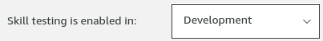
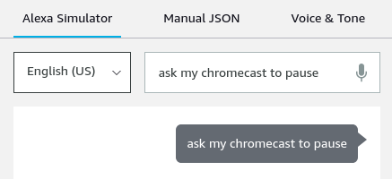
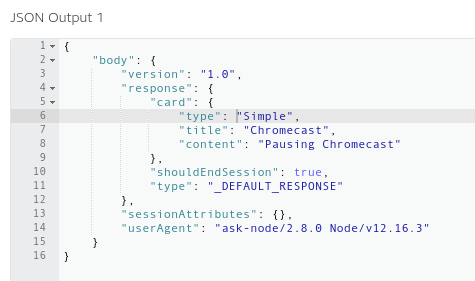
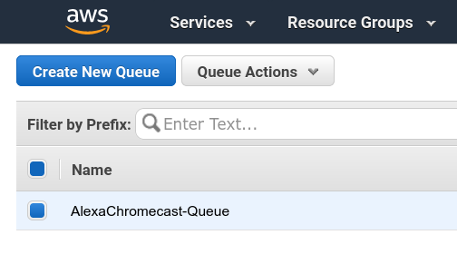
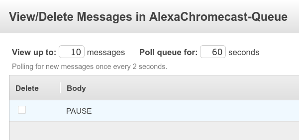

# Alexa Chromecast Controller

This project enables your Alexa to play and pause Chromecast. You need to have a local device -- this could be a Raspberry Pi -- in the same network as the Chromecast on which you can run the controller. The local device does not need to be accessible over the internet. The controller uses long polling to poll an SQS queue that receives messages from Alexa.

You need an AWS account and an Alexa Developer account.

## System Overview

There are three parts to the application:

1. infrastructure that is running on AWS;
2. an Alexa skill;
3. controller that runs on a local device.

The most important resource in the infrastructure are the Lambda function that gets invoked by the Alexa Skill and the SQS skill on which messages are posted. For example, when you ask Alexa 'ask my chromecast to pause' the `PAUSE` message will be posted on the SQS queue.

The controller polls the SQS queue and takes the latest message and executes the given command on the Chromecast using the `pychromecast` library.

## Installation

### Infrastructure

Execute the following command in the `cdk` folder.

    pnpx install
    pnpx cdk deploy \
        --parameters "VendorId=${VENDOR_ID}" \
        --parameters "ClientId=${CLIENT_ID}" \
        --parameters "ClientSecret=${CLIENT_SECRET}" \
        --parameters "RefreshToken=${REFRESH_TOKEN}" \
        --outputs-file deploy.json

You can get a client ID, client secret and refresh token by following the instructions https://developer.amazon.com/en-US/docs/alexa/smapi/get-access-token-smapi.html

You can get your vendor ID following the instructions https://github.com/alexa/alexa-smarthome/wiki/How-to-get-your-vendor-ID

### Controller

The controller has to be installed on a device that is running in the same network as the Chromecast.

Execute the following command in the `controller` folder. These commands only have to run once.

    python3 -m venv env
    source activate env
    pip install -r requirements.txt

Execute the following command in the root of the project to start the controller.

    python controller/poll.py $CHROMECAST_NAME cdk/deploy.json

## Usage

> Alexa, ask my chromecast to pause

> Alexa, ask my chromecast to resume

> Alexa, ask my chromecast to play

## Testing

### Alexa Developer Console

After deploying the infrastructure you should see the Chromecast skill in the [Alexa Developer Console](https://developer.amazon.com/alexa/console/ask). Click on the skill name and go to the 'Test' tab. Set "Skill testing is enabled in:" to "Development"

Next, you can enter example text in the text box.

Finally, you should see the following output in the text field on the right.

### AWS Management Console

After seeing the successful response in the Alexa Developer Console we can move to the AWS Management Console. Go to the SQS service. You should see the `AlexaChromecast-Queue`.

Click on "Queue Actions" and then "View/Delete Messages". A dialog will open where you can look for incoming messages. If your controller is not running, you should see incoming messages after clicking "Start Polling for Messages".

